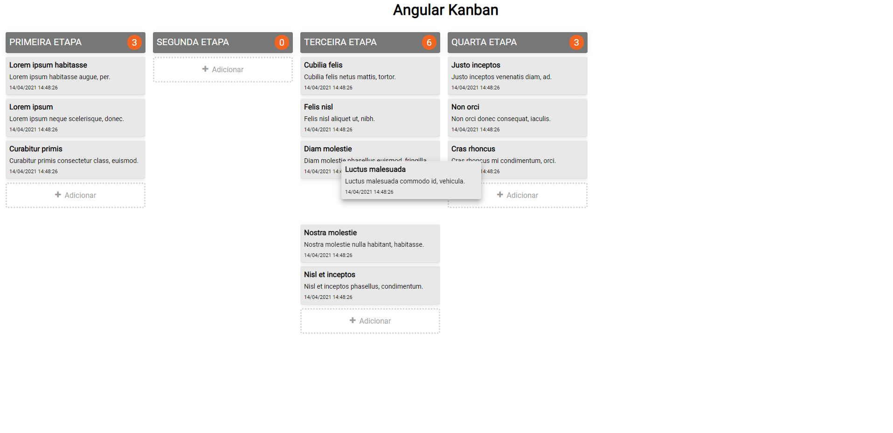

# Angular Kanban

  

## Escopo

Este projeto é uma aplicação Angular.
O objetivo desta aplicação é fornecer um componente Kanban para uma aplicação Angular.

## Tecnologias

- angular cli: 11.2.8
- node: 14.16.1

## Como instalar

- Baixe ou clone este repositório usando `git clone https://github.com/geisonfeitosa/Angular-Kanban.git`.
- Dentro do diretório, execute `npm install` para instalar as dependências.

## Como executar

- Dentro do diretório, execute ng serve para executar a versão de desenvolvimento.
- Depois acesse http://localhost:4200/.

# Angular Kanban